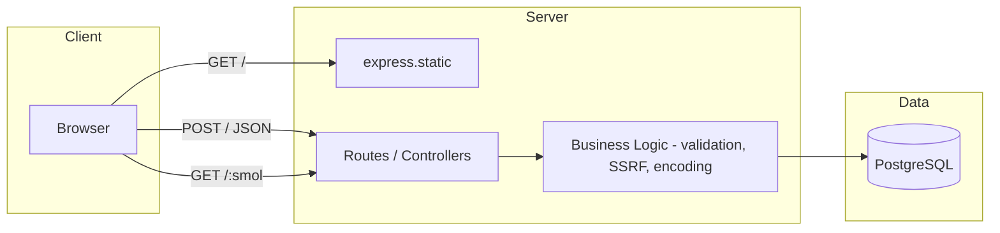

# smol 

Small Express API plus a static UI, backed by PostgreSQL and Prisma. Short codes are derived from numeric IDs with base62 encoding and a configurable offset.

## Local setup

```bash
git clone <repository-url>
cd smol
cp .env.example .env
# Edit .env: set DATABASE_URL, OFFSET, and PORT

npm install
npx prisma migrate dev
npm run dev
```

## Architecture



## Core 
- `POST /` →  create short code  
- `GET /:smol` →  redirect  
- Basic SSRF-safe URL validation  
- Deterministic base62 codes

## TODO
- [ ] Add unit and integration tests
- [ ] Dockerize application (app + database)
- [ ] Implement rate limiting to prevent abuse
